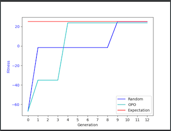
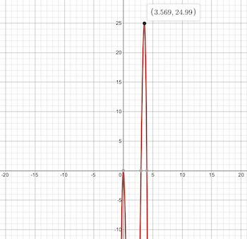

# An Evolutionary Algorithm to solve a simple function maximization problem

## Sample Function:
\[ f(x) = -x * 8 * x * (x - 3) * (x - 4) \]

## Methods:
Compare the performance between One-plus-One algorithm vs Random algorithm baseline
### One-plus-One Algorithm
1. Set the population size being equal to 1.
2. Evaluate the population.
3. Mutate the best individual.
4. Evaluate the mutants.
5. Compare the mutation with the best and select the individual with the highest fitness value.
6. Repeat until reaching an exception.

### Random Algorithm
1. Set the population size being equal to 1.
2. Evaluate the population.
3. Generate a random individual as offspring from an original individual.
5. Compare the offspring with the best and select the individual with the highest fitness value.
6. Store the individual with the best fitness value

### Visualization Result



## Result
Execute the experiment in 15 epochs and see how the algorithm evolved.
```
```
Compare the final result with the global maximum of the graph function to evaluate the algorithm performance.

 

*Fig. 2: The global maximum of the given function*
